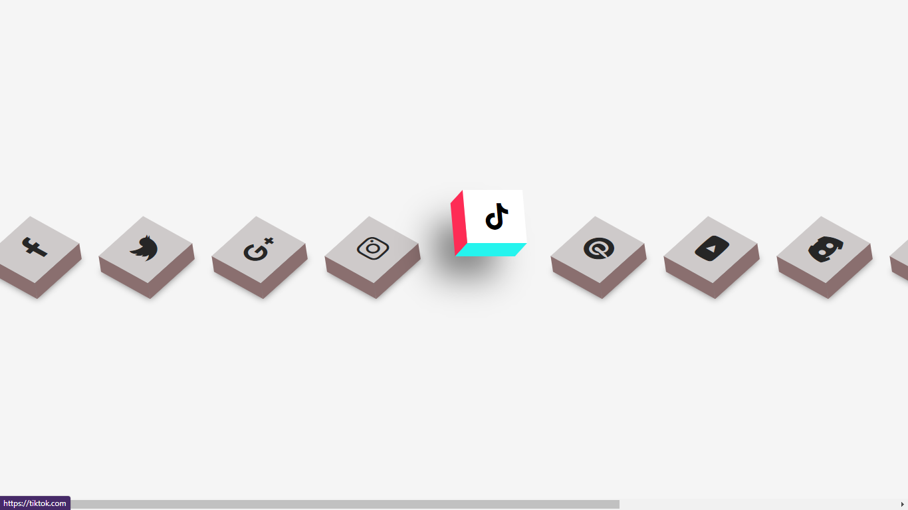

# 3d-icons
> This project is composed by a list of various icons with 3D effect using pure CSS.

## 🚀 Project Description  
This project is a list of various icons with 3D effect using pure CSS. This webpage is composed by some brand icons with their respective access links. My intention in this project is, over time, to add more and more icons in a interesting, organizated and fun way to use in different types of websites.

---

## ✨ Functionalities  
- **3D Effect:** each icon has a 3D hover effect. 
- **Hyperlink:** each icon is hyperlinked with their respective brand/social media.

---

## 🛠️ Technologies Used  
| Technology        | Description         |  
|--------------------|---------------------|  
| HTML          | Frontend Development      |  
| CSS         | Frontend Development      |  
| Font Awesome          | Icons Use      |  
| US Brand Color         | Colors Search     |  

---

## 📦 Project Link / Demo  
(You can access the project demo in the follow link)
* https://github.com/lucsantosdev/3d-icons

---

## 📝 License
This project is licensed under the MIT License. See the LICENSE file for details.

---

## 💬 Connect with Me
Follow my journey and other projects on:
- **Email:** [lucsantosdev@gmail.com](mailto:lucsantosdev@gmail.com)
- **LinkedIn:** [lucsantosdev](https://github.com/lucsantosdev)
- **GitHub:** [lucsantosdev](https://github.com/lucsantosdev)

---

🧠 Je 9:23-24
